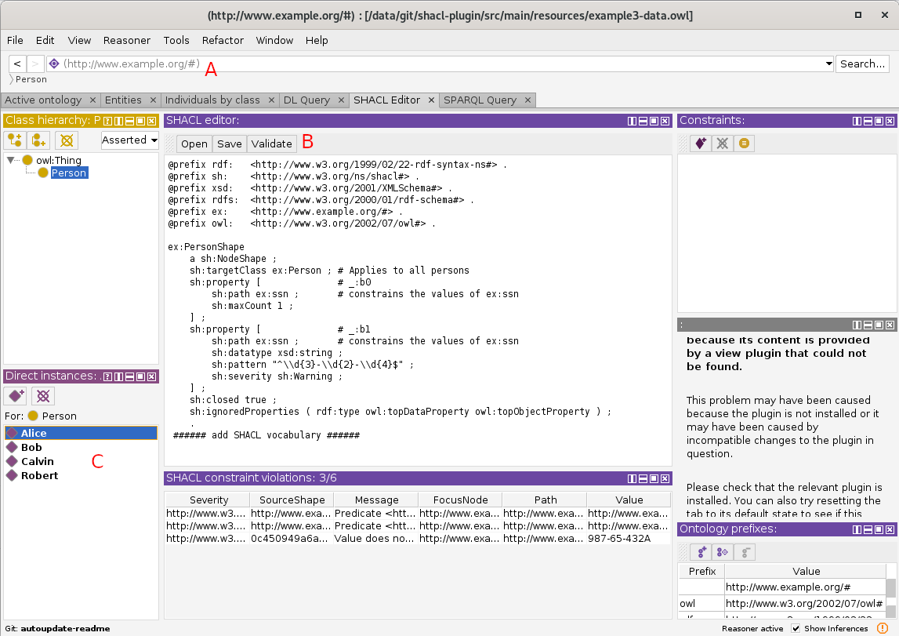

### SHACL4Protege v1.0.0 

A SHACL constraint validation plugin for Protégé Desktop [1].

The plugin provides a tab, in which you can open and edit a SHACL file (see B), to validate the ontology that is loaded in Protégé (see A).

Further, you can filter the result table by the classes and individuals of the ontology (see C).

### About

The plugin is tried and tested using Protege 5.5.0 on 
* Debian 10 (Buster) with OpenJDK 11, 
* Windows 10 (1809) with the bundled JRE 8, 
* and Mac OSX Catalina with JDK 8.

The plugin developed using TopBraid SHACL Engine 1.3.1 [2] and Apache Jena 3.14.0 [3].   

The plugin was developed by Xiashuo Lin (`@xlin`) and Fajar Ekaputra (`@fekaputra`) at TU Wien.
Later on, André Wolski (`@locke`) contributed significantly to clean up the old code and added several features. 

#### How to use

1. Open Protégé Desktop
    * Select File -> Check for plugins... to get the list of available plugins. Select "SHACL4Protege Constraint Validator" and "Install" it
    * Alternatively: Download the latest jar file from [the latest release](https://github.com/fekaputra/shacl-plugin/releases) and copy it into the /plugins folder of your Protégé Desktop installation
2. Restart Protégé Desktop
3. (optional) Download the example file [example3-data.owl](https://raw.githubusercontent.com/fekaputra/shacl-plugin/master/src/main/resources/example3-data.owl)
    * open it in Protégé Desktop
4. Open Window -> Tabs -> SHACL Editor
    * By default, the SHACL Editor has pre-loaded SHACL constraints for the example ontology of step 3
    * You can modify the constraints, or load a different SHACL file into the editor
    * Click the "Validate" button below the SHACL editor to validate the ontology that is loaded in Protégé against the shapes defined in the SHACL editor
5. (alternative) Open Window -> Tabs -> Minimal SHACL Editor
    * Click the "Validate" button below the SHACL editor to validate the ontology that is loaded in Protégé against the shapes defined in the SHACL editor

[1] https://protege.stanford.edu/   
[2] https://github.com/TopQuadrant/shacl   
[3] https://github.com/apache/jena
